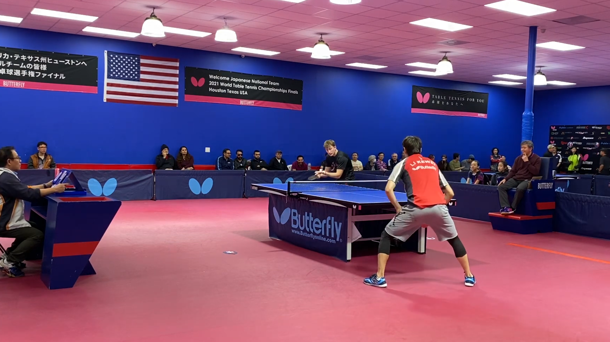

# TT-Zip (Table Tenis Zipper)

A utility designed to review MP4 videos of Table Tenis games and reduce video size and time to just the important parts, e.g. "Ball on the table".

This is for educational purposes only and meant to simply reduce analysis time.

It's important to understand that the results are not perfect given the simplicty of the solutions, but provides a good starting point with focus on "what really mattered".

## Example of the Results

Random original video: https://www.youtube.com/watch?v=8CIrbiW6lRY a *13:29* minutes video.

The resulting video is only *6:18* minutes, and can be seen here:

## Process

1. Extract Audio from Video into wav, using SOX
2. Analyse audio peaks using numpy and scipy
3. Reduce any video parts that are 1.5 seconds away from "audio peaks"

This is, of course, extremly naive, but nonetheless, a starting point.

#### Install & Run

1. Make sure imagamagick is installed locally.
2. pip install -U -r requirements.txt
3. `./tt-zip.sh <*.mp4>`

